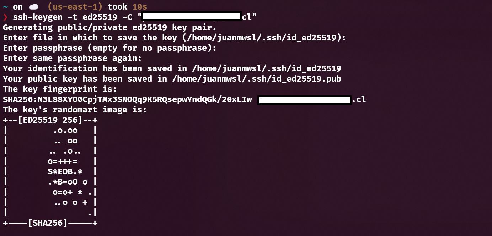

# Mi Proyecto Git
Este es un proyecto para practicar Git con repositorios remotos.

## Desarrollo

### Clave SSH para conexión remota

- Creación de clave ssh

- Agregar clave generada al agente ssh

### Proyecto

- Clonación del proyecto

- Creación de archivos del proyecto y commit 

- Verificación de creación de rama adicional

